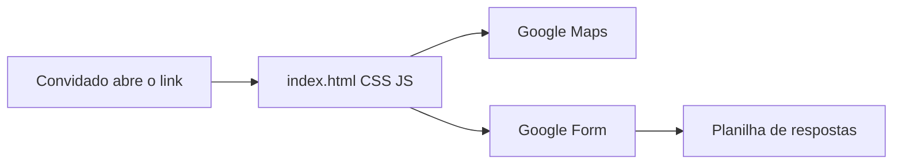

# Convite estático do Dom (1 ano)

Site de uma página, sem framework e sem servidor. Conteúdo baseado no convite atual: [FestaLab — Dom 24/out](https://festalab.com.br/dom-24out). Você troca fotos e cores depois; o esqueleto já fica pronto para publicar.

## O que a página terá (mesmo fluxo da FestaLab)

- **Topo:** nome (Dom), idade (1 ano) e foto/placeholder
- **Navegação âncora:** Mensagem · O Grande Dia · RSVP · Recadinhos
- **Mensagem:** texto de convite
- **O Grande Dia:** sábado 24/10/2026, a partir das 15:00; endereço (Av. Ulysses Guimarães, 151, Condomínio Sol Nascente — Sussuarana, Salvador); mapa do Google Maps embutido
- **RSVP + Recadinhos:** um Google Form na página (nome, vou/não vou, quantidade de pessoas, recado)
- Layout mobile-first (convite circula no WhatsApp)

Não inclui lista de presentes nem backend próprio.

## Stack

Arquivos na raiz do projeto (hoje vazio):

- [`index.html`](index.html) — seções e iframes
- [`styles.css`](styles.css) — cores em variáveis CSS (`--cor-fundo`, `--cor-destaque`, etc.) para você mudar depois
- [`script.js`](script.js) — menu mobile e scroll suave
- [`assets/`](assets/) — placeholders de foto; você substitui pelos arquivos reais
- [`README.md`](README.md) — como publicar e como colar o Form

Sem React, sem build, sem `npm`. Qualquer editor abre e o GitHub Pages serve os arquivos como estão.

## Google Form (você cria uma vez)

1. No Google Forms: perguntas Nome, Vai? (Eu vou / Não vou), Quantas pessoas, Recadinho (opcional).
2. Enviar → Incorporar HTML → copiar o `src` do iframe.
3. Colar no `index.html` no lugar do placeholder.

Enquanto o Form não existir, a página mostra um bloco “cole o link do formulário aqui” para não travar o site.

## Hospedagem gratuita: GitHub Pages

URL final no formato `https://SEU-USUARIO.github.io/Niver_Dom` (HTTPS incluso, sem cartão).

Passos depois do código pronto:

1. Criar repositório no GitHub e enviar esta pasta
2. Settings → Pages → Source: `main` / pasta `/` (raiz)
3. Aguardar 1–2 minutos e abrir o `.github.io`

Alternativa, se preferir outro subdomínio depois: Cloudflare Pages (`*.pages.dev`) com o mesmo HTML, sem mudar o código.

Domínio próprio (ex.: `niverdom.com.br`) não é gratuito; o plano usa só o subdomínio de graça.

## Visual (fácil de trocar)

Tema infantil claro, tipografia via Google Fonts, seções empilhadas como a FestaLab. Fotos e paleta ficam isoladas em `assets/` e nas variáveis do CSS — sem redesenhar o HTML para mudar o visual.

## Fora do escopo

- Conta/login, painel admin, banco de dados
- Compra de domínio
- Copiar imagens ou CSS da FestaLab (referência de estrutura só)
